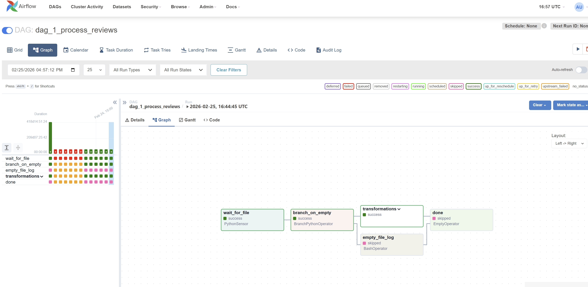
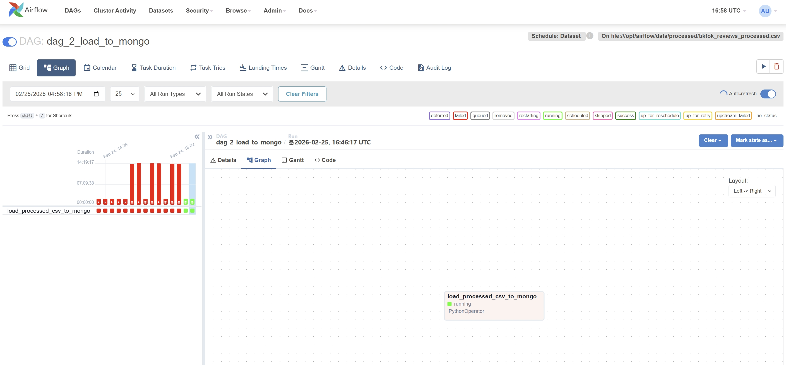
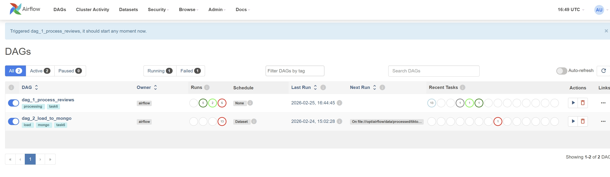
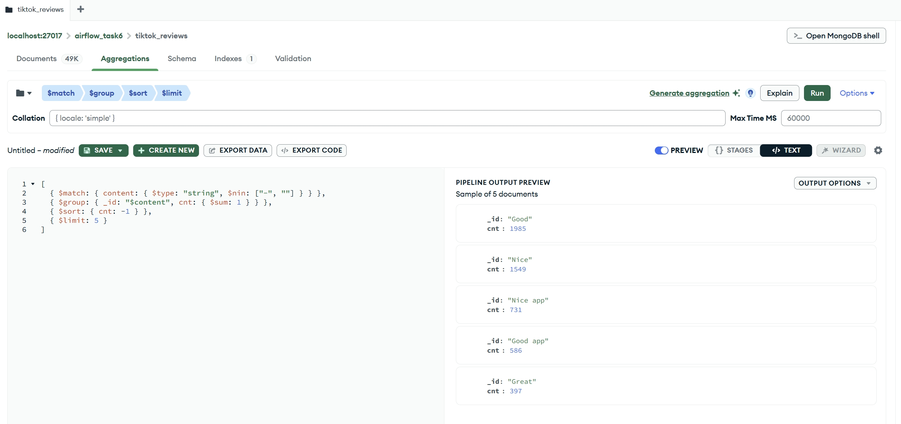
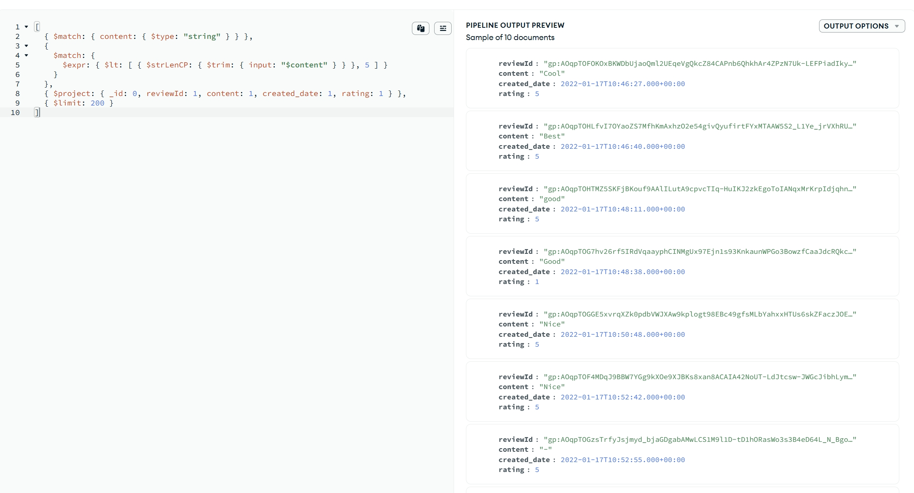
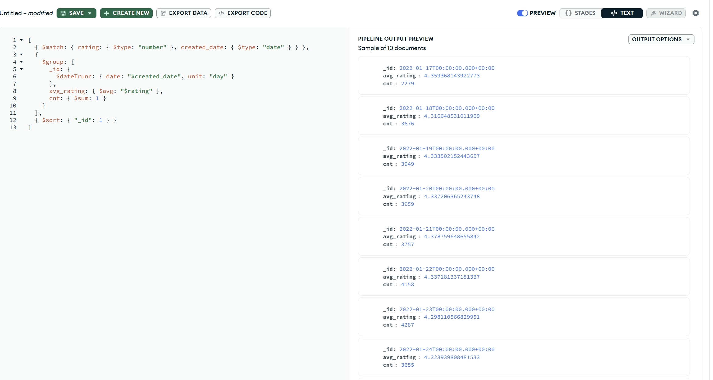

# Task 6 — Airflow + MongoDB ETL

## 1. Architecture

- Airflow (Docker)
- PostgreSQL (metadata)
- MongoDB (target DB)
- Pandas transformations
- Dataset-based scheduling (DAG2 listens to Dataset produced by DAG1)

### 1.1 Input data (source file)

The DAG expects the source CSV in `data/incoming/`. Download the file and save it as `tiktok_google_play_reviews.csv` in that folder.

**Download:** [TikTok Google Play reviews (Google Drive)](https://drive.google.com/file/d/1crEUrJMn3XI4ukzlTN8r0ZAzdOVYhpNq/view)

After downloading, place the file at: `task_6_airflow/data/incoming/tiktok_google_play_reviews.csv`.

## 2. DAGs

### 2.1 DAG 1 — Data Processing



### 2.2 DAG 2 — Load to Mongo



### 2.3 All DAGs



## 3. MongoDB Aggregations

### 3.1 Top 5 comments



Pipeline:

```json
[
  { "$match": { "content": { "$type": "string", "$ne": "-", "$ne": "" } } },
  { "$group": { "_id": "$content", "cnt": { "$sum": 1 } } },
  { "$sort": { "cnt": -1 } },
  { "$limit": 5 }
]
```

### 3.2 Content < 5 chars



Pipeline:

```json
[
  { "$match": { "content": { "$type": "string" } } },
  {
    "$match": {
      "$expr": { "$lt": [ { "$strLenCP": { "$trim": { "input": "$content" } } }, 5 ] }
    }
  },
  { "$project": { "_id": 0, "reviewId": 1, "content": 1, "created_date": 1, "rating": 1 } },
  { "$limit": 200 }
]
```


### 3.3 Avg rating per day



Pipeline:

```json
[
  { "$match": { "rating": { "$type": "number" }, "created_date": { "$type": "date" } } },
  {
    "$group": {
      "_id": {
        "$dateTrunc": { "date": "$created_date", "unit": "day" }
      },
      "avg_rating": { "$avg": "$rating" },
      "cnt": { "$sum": 1 }
    }
  },
  { "$sort": { "_id": 1 } }
]
```

---

## 4. Useful commands

### 4.1 Running the project (Docker + WSL)

**1.** Open Ubuntu from PowerShell:

```bash
wsl -d Ubuntu
```

**2.** Start Docker (if auto-start is disabled):

```bash
sudo service docker start
```

Check:

```bash
docker ps
```

**3.** Go to the project folder

If the project is on Windows:

```bash
cd /mnt/d/Coding/Innowise_internship/task_6_airflow
```

If the project is in Ubuntu:

```bash
cd ~/projects/task_6_airflow
```

**4.** First run (clean build):

```bash
docker compose down
docker compose build --no-cache
docker compose up -d
```

**5.** Normal run (after first build):

```bash
docker compose up -d
```

Check containers:

```bash
docker ps
```

**6.** Restart Airflow services:

```bash
docker restart task6_airflow_webserver task6_airflow_scheduler
```

**7.** Stop the project:

```bash
docker compose down
```

### 4.2 Auto-start Docker when WSL starts (one-time)

```bash
echo 'sudo service docker start > /dev/null 2>&1' >> ~/.bashrc
```

Docker will start automatically when you open Ubuntu.

### 4.3 Service URLs

| Service    | URL / Port          |
|-----------|---------------------|
| Airflow UI| http://localhost:8080 |
| MongoDB   | port 27017          |

### 4.4 Handy commands

View logs:

```bash
docker logs task6_airflow_webserver
docker logs task6_airflow_scheduler
```

Run a command inside a container:

```bash
docker exec -it task6_airflow_webserver bash
```

Connect to Mongo:

```bash
docker exec -it task6_mongo mongosh -u mongo -p mongo --authenticationDatabase admin
```
